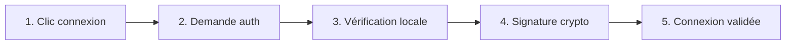

<div align="center">

# Guide d'authentification IBEX

### Authentification moderne sans mot de passe avec WebAuthn

[](https://www.w3.org/TR/webauthn/)
[](https://fidoalliance.org/)
[](https://www.passkeys.io/)

[Pourquoi WebAuthn ?](#pourquoi-webauthn-) • [Configuration](#configuration) • [Utilisation](#utilisation) • [Sécurité et bonnes pratiques](#sécurité-et-bonnes-pratiques)

</div>

---

## Qu'est-ce que WebAuthn ?

<table>
<tr>
<td width="50%">

### Le standard moderne

WebAuthn (Web Authentication) est un **standard W3C** qui révolutionne l'authentification en ligne. Au lieu de mots de passe, il utilise des **passkeys** - des identifiants cryptographiques uniques stockés sur votre appareil.

</td>
<td width="50%">

### En bref

- Pas de mot de passe
- Biométrie ou PIN
- Anti-phishing natif
- Support universel

</td>
</tr>
</table>

---

## Pourquoi WebAuthn ?

| Avantage               | Description                                                                        |
| ---------------------- | ---------------------------------------------------------------------------------- |
| **Sécurité maximale**  | Les passkeys sont impossibles à voler ou deviner, contrairement aux mots de passe  |
| **Expérience simple**  | Une authentification biométrique ou PIN - pas besoin de mémoriser de mots de passe |
| **Anti-phishing**      | Chaque passkey est liée à un site spécifique, empêchant les attaques               |
| **Standard universel** | Supporté par tous les navigateurs modernes et appareils                            |

---

## Comment ça fonctionne ?

### Le processus en 5 étapes



<details>
<summary><b>Détail de chaque étape</b></summary>

1. **Déclenchement** : L'utilisateur clique sur "Se connecter"
2. **Demande** : Le navigateur demande l'authentification
3. **Vérification** : PIN, biométrie ou clé physique
4. **Signature** : Une signature cryptographique unique est créée
5. **Validation** : Le serveur vérifie et connecte l'utilisateur

</details>

---

## Types d'authentificateurs

### Authentificateurs intégrés (recommandés)


### Clés de sécurité physiques


---

## Configuration

### Prérequis

| Exigence       | Description                                   |
| -------------- | --------------------------------------------- |
| **HTTPS**      | Obligatoire (sauf localhost pour le dev)      |
| **Navigateur** | Chrome 88+, Firefox 60+, Safari 14+, Edge 88+ |
| **Config**     | Domaine et RP ID correctement configurés      |

### Configuration minimale

```typescript
import { IbexProvider } from '@absconse/ibex-sdk'

const config = {
  baseURL: 'https://api.ibexwallet.org',
  domain: 'votre-domaine.com', // ⚠️ Doit correspondre exactement
}

function App() {
  return (
    <IbexProvider config={config}>
      <YourApp />
    </IbexProvider>
  )
}
```

<details>
<summary><b>Configuration avancée</b></summary>

```typescript
const config = {
  baseURL: 'https://api.ibexwallet.org',
  domain: 'votre-domaine.com',
  rpId: 'votre-domaine.com', // Identifiant Relying Party
  timeout: 30000, // Timeout en ms (défaut: 30s)
  debug: true, // Logs détaillés
}
```

</details>

---

## Utilisation

### Le hook `useIbex()`

```typescript
import { useIbex } from '@absconse/ibex-sdk'

function AuthComponent() {
  const {
    user, // Données utilisateur
    isLoading, // État de chargement
    error, // ❌ Erreurs
    signIn, // Connexion
    signUp, // Inscription
    logout, // Déconnexion
  } = useIbex()
}
```

### Composant de connexion complet

```tsx
function LoginComponent() {
  const { user, isLoading, error, signIn, signUp, logout, clearError } = useIbex()

  // ❌ Gestion des erreurs
  if (error) {
    return (
      <div className="error-container">
        <h3>Erreur d'authentification</h3>
        <p>{error}</p>
        <button onClick={clearError}>Réessayer</button>
      </div>
    )
  }

  // Chargement
  if (isLoading) {
    return (
      <div className="loading-container">
        <Spinner />
        <p>Vérification...</p>
      </div>
    )
  }

  // Non connecté
  if (!user) {
    return (
      <div className="login-container">
        <h1>Bienvenue sur IBEX</h1>
        <p>Connectez-vous avec votre passkey</p>

        <div className="auth-buttons">
          <button onClick={signIn} className="btn-primary">
            Se connecter
          </button>
          <button onClick={() => signUp('Mon Passkey')} className="btn-secondary">
            Créer un compte
          </button>
        </div>

        <div className="help-text">
          <p>
            <strong>Première fois ?</strong> Créez votre passkey
          </p>
          <p>
            <strong>Déjà inscrit ?</strong> Connectez-vous avec votre PIN/biométrie
          </p>
        </div>
      </div>
    )
  }

  // Connecté
  return (
    <div className="user-container">
      <h2>Bonjour {user.email} !</h2>
      <div className="user-details">
        <p>
          <strong>ID :</strong> {user.id}
        </p>
        <p>
          <strong>KYC :</strong> {user.kyc.status}
        </p>
        {user.wallet && (
          <p>
            <strong>Wallet :</strong> {user.wallet.address}
          </p>
        )}
      </div>
      <button onClick={logout} className="btn-danger">
        Se déconnecter
      </button>
    </div>
  )
}
```

---

## Flux d'authentification

### Première inscription (SignUp)

```typescript
const handleSignUp = async () => {
  try {
    await signUp('Mon Passkey IBEX') // Nom personnalisé
    // ✅ Compte créé et utilisateur connecté
  } catch (error) {
    // ❌ Erreur affichée automatiquement
  }
}
```

**Ce qu'il se passe :**

| Étape | Action                                            |
| ----- | ------------------------------------------------- |
| 1️⃣    | Clic sur "Créer un compte"                        |
| 2️⃣    | Choix de l'authentificateur (Touch ID, PIN, etc.) |
| 3️⃣    | Configuration de l'authentificateur               |
| 4️⃣    | Passkey créée et stockée localement               |
| 5️⃣    | ✅ Connexion automatique                          |

### Connexions suivantes (SignIn)

```typescript
const handleSignIn = async () => {
  try {
    await signIn()
    // ✅ Connexion réussie
  } catch (error) {
    // ❌ Gestion d'erreur
  }
}
```

**Ce qu'il se passe :**

| Étape | Action                            |
| ----- | --------------------------------- |
| 1️⃣    | Clic sur "Se connecter"           |
| 2️⃣    | Demande d'authentification        |
| 3️⃣    | Vérification (PIN/biométrie/clé)  |
| 4️⃣    | Signature cryptographique générée |
| 5️⃣    | ✅ Connexion validée              |

### Déconnexion (Logout)

```typescript
const handleLogout = async () => {
  await logout()
  // ✅ Déconnexion réussie
}
```

---

## Sécurité et bonnes pratiques

### ✅ Configuration sécurisée

```typescript
// ✅ BON
const config = {
  baseURL: 'https://api.ibexwallet.org', // HTTPS
  domain: 'votre-domaine.com', // Domaine exact
  rpId: 'votre-domaine.com', // Correspond au domaine
  timeout: 30000, // Timeout raisonnable
}

// ❌ MAUVAIS
const badConfig = {
  baseURL: 'http://api.ibexwallet.org', // ❌ HTTP non sécurisé
  domain: '*.votre-domaine.com', // ❌ Wildcard non supporté
  rpId: 'different-domain.com', // ❌ Ne correspond pas
}
```

### Validation des utilisateurs

```typescript
function SecureAction() {
  const { user } = useIbex()

  const handleAction = () => {
    // ✅ Vérifier l'authentification
    if (!user) {
      alert("Connectez-vous d'abord")
      return
    }

    // ✅ Vérifier le KYC si nécessaire
    if (user.kyc.status !== 'verified') {
      alert('Complétez votre KYC')
      return
    }

    // Action sécurisée
    performAction()
  }

  return <button onClick={handleAction}>Action sécurisée</button>
}
```

### Gestion des erreurs

<details>
<summary><b>Messages d'erreur détaillés</b></summary>

```typescript
const getErrorMessage = (error: string) => {
  const messages = {
    NotSupportedError: 'Navigateur non supporté. Utilisez un navigateur récent.',
    NotAllowedError: 'Authentification refusée. Réessayez.',
    SecurityError: 'Erreur de sécurité. Vérifiez HTTPS et le domaine.',
    TimeoutError: 'Authentification expirée. Réessayez.',
    NetworkError: 'Erreur de connexion. Vérifiez votre réseau.',
    Unauthorized: 'Session expirée. Reconnectez-vous.',
  }

  return messages[error] || `Erreur inattendue: ${error}`
}
```

</details>

```typescript
function ErrorHandler() {
  const { error, clearError } = useIbex()

  if (!error) return null

  return (
    <div className="error-container">
      <div className="error-icon">⚠️</div>
      <h3>Erreur d'authentification</h3>
      <p>{getErrorMessage(error)}</p>
      <div className="error-actions">
        <button onClick={clearError}>Réessayer</button>
        <button onClick={() => window.location.reload()}>Recharger</button>
      </div>
    </div>
  )
}
```

---

## Support multi-appareils

### Synchronisation des passkeys

| Plateforme    | Mécanisme               | Disponibilité                             |
| ------------- | ----------------------- | ----------------------------------------- |
| **iOS/macOS** | iCloud Keychain         | Tous les appareils Apple du même compte   |
| **Android**   | Google Password Manager | Tous les appareils Android du même compte |
| **Windows**   | Microsoft Account       | Tous les appareils Windows du même compte |

### Conseils multi-appareils

```tsx
function MultiDeviceInfo() {
  return (
    <div className="info-box">
      <h3>Vos appareils</h3>
      <p>
        Vos passkeys sont synchronisées entre vos appareils connectés au même compte (Apple ID,
        Google Account, Microsoft Account).
      </p>

      <ul>
        <li>✅ Utilisez le même compte partout</li>
        <li>✅ Activez la synchronisation dans les paramètres</li>
        <li>✅ Vos passkeys sont chiffrées de bout en bout</li>
      </ul>
    </div>
  )
}
```

---

## Dépannage

### Problèmes courants

<details>
<summary><b>❌ NotSupportedError</b></summary>

**Causes :**

- Navigateur trop ancien
- WebAuthn non supporté

**Solutions :**

- ✅ Mettez à jour votre navigateur
- ✅ Utilisez Chrome 88+, Firefox 60+, Safari 14+
- ✅ Vérifiez HTTPS en production

</details>

<details>
<summary><b>❌ SecurityError</b></summary>

**Causes :**

- HTTP au lieu de HTTPS
- Domaine mal configuré
- RP ID incorrect

**Solutions :**

- ✅ Utilisez HTTPS obligatoirement
- ✅ Vérifiez `domain` et `rpId` correspondent
- ✅ Pas de wildcard dans le domaine

</details>

<details>
<summary><b>❌ NotAllowedError</b></summary>

**Causes :**

- Utilisateur a refusé
- Popup bloquée
- Permission non accordée

**Solutions :**

- ✅ Guidez l'utilisateur à autoriser
- ✅ Vérifiez les permissions du navigateur
- ✅ Réessayez l'authentification

</details>

<details>
<summary><b>❌ TimeoutError</b></summary>

**Causes :**

- Authentification trop longue
- Connexion lente

**Solutions :**

- ✅ Augmentez le timeout (30s → 60s)
- ✅ Vérifiez la connexion internet
- ✅ Réessayez

</details>

### Activer les logs de debug

```typescript
const config = {
  baseURL: 'https://api.ibexwallet.org',
  domain: 'votre-domaine.com',
  debug: true, // Logs détaillés dans la console
}
```

---

## Migration depuis les mots de passe

### Comparaison

| Critère         | Mots de passe    | WebAuthn   |
| --------------- | ---------------- | ---------- |
| Sécurité        | ❌ Vulnérable    | ✅ Maximum |
| UX              | ❌ Complexe      | ✅ Simple  |
| Phishing        | ❌ Vulnérable    | ✅ Protégé |
| Coûts           | ❌ Support élevé | ✅ Minimal |
| Multi-appareils | ❌ Difficile     | ✅ Natif   |

</details>
